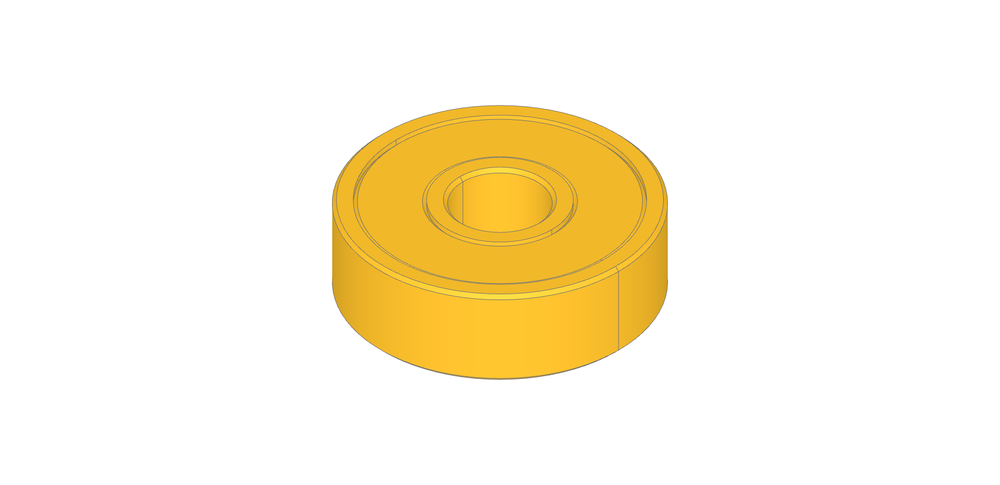
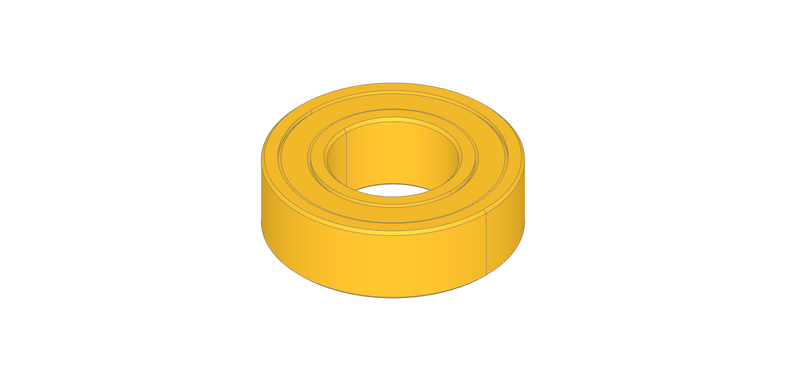
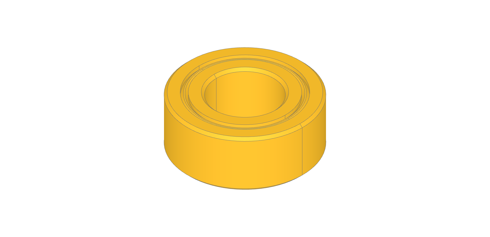
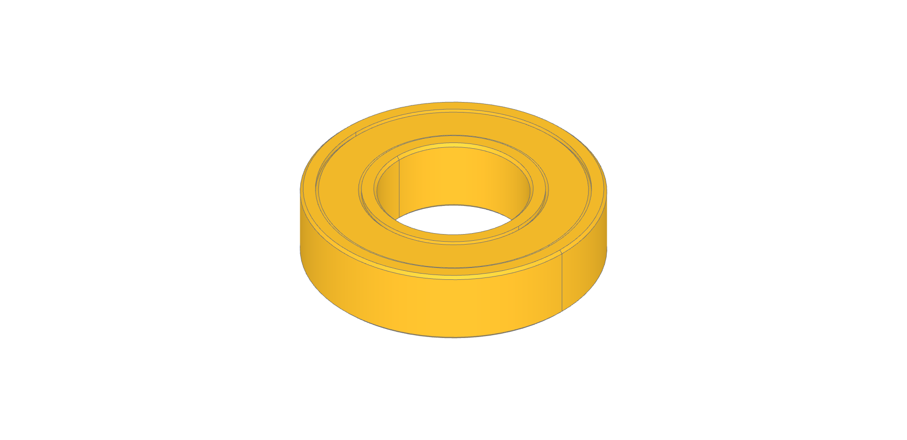

Bearings
========

.. autoclass:: bd_vslot.bearings.Bearing625
   :members:
   :undoc-members:
   :show-inheritance:

.. autoclass:: bd_vslot.bearings.Bearing688
   :members:
   :undoc-members:
   :show-inheritance:

.. autoclass:: bd_vslot.bearings.Bearing105
   :members:
   :undoc-members:
   :show-inheritance:

.. autoclass:: bd_vslot.bearings.Bearing
   :members:
   :undoc-members:
   :show-inheritance:

